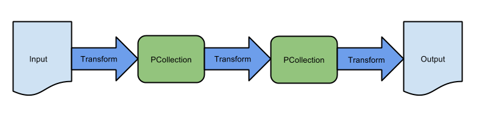

## Inspiration: Apache Beam and Cloud Dataflow

[Apache Beam](https://beam.apache.org/get-started/beam-overview/) is a free to use, open source project that helps users represent their long-running scientific computations in terms of generic “data pipelines”. From the [Apache Beam](https://beam.apache.org/get-started/beam-overview/) documentation, a simple data pipeline is represented like this:

[Apache Beam](https://beam.apache.org/get-started/beam-overview/) has become popular in part because it integrates easily with Cloud providers (see [Cloud Dataflow](https://cloud.google.com/dataflow/)), giving users the freedom to execute scientific algorithms in parallel over a seemingly unbounded number of machines.

Similar to this proposal, in [Apache Beam](https://beam.apache.org/get-started/beam-overview/), a user defines how to read their data, how to transform it, and how to write out transformed data so it can be read by a next processing step.

Unlike this proposal, [Apache Beam](https://beam.apache.org/get-started/beam-overview/) is highly complex and comes with some important limitations:

+ Users must fit their data into what [Apache Beam](https://beam.apache.org/get-started/beam-overview/) calls a [PCollection](https://beam.apache.org/documentation/programming-guide/#pcollections) so data can be processed in a distributed way. This leads to several complications: random access to a PCollection is not allowed and every element in the PCollection must be of the same type (see [PCollection characteristics](https://beam.apache.org/documentation/programming-guide/#pcollection-characteristics)). In other words, a PCollection cannot represent a C++ struct, whereas a JSON object can.

+ [Apache Beam](https://beam.apache.org/get-started/beam-overview/) is currently not programming language interoperable. That is, as of today one cannot define a Python processing step and a Java processing step and configure them to be run in the same data pipeline (although [interoperability is actively being developed](https://beam.apache.org/roadmap/portability/)).

+ [Apache Beam](https://beam.apache.org/get-started/beam-overview/) only supports scientific algorithms written in Python, Java, and Go (see [SDKs](https://beam.apache.org/documentation/)).

Despite its complexities and limitations, [Apache Beam](https://beam.apache.org/get-started/beam-overview/) offers several notable, reusable principles that make scientific workflows more flexible and understandable:

+ **Represent dataflow as a series of independent steps.** This makes it much easier to visualize the control flow of an algorithm, for example as a directed graph.

+ **Treat input data as immutable (read-only).** This is helpful for keeping data processing steps truly independent of one another. To illustrate why this is important, imagine that two data processing steps are executed in parallel and both read from the same input file. If one of the steps modifies the input file without the other step knowing about the change, then the behavior of the entire algorithm may be undefined.

+ **Precisely define the interface of a step (inputs and outputs).** This principle supports multiple implementations of a step, where each implementation can easily be plugged in and out of the dataflow.

This proposal tries to incorporate these principles. It also paves the way to using a gold-standard project like [Apache Beam](https://beam.apache.org/get-started/beam-overview/) in the future. See [Cloud Support](../README.md#introduction) for more detail.

[[Back to Table of Contents]](../README.md#table-of-contents)
