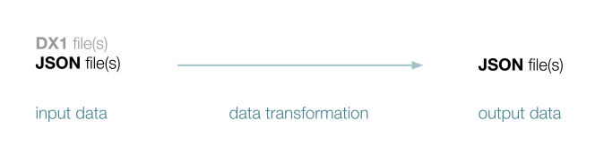

## Summary of Proposal

The main suggestion of this proposal is to write the output of each step in the Crab algorithm to a working directory on the user’s filesystem, ideally as [JSON](https://www.json.org): a simple, readable format that is widely supported by modern programming languages and web technologies.

In short, for each step in the Crab algorithm:



The main benefit of this approach is *flexibility*. The files generated by each step in the Crab algorithm can easily be:

+ **Inspected by a human** to improve debugging and development
+ **Passed to C++ and Python** versions of the same step
+ **Compared to expected output data** to test the correctness of each step

Additionally, with more linguistic data available on the user's filesystem, it is much easier for the user to run a *single* step of the Crab algorithm, in isolation from any other step. For example:

```console
$ sort_words /path/to/browncorpus.dx1
sorted_words.json

$ find_protostems sorted_words.json
protostems.json

$ find_protostem_words sorted_words.json protostems.json
protostem_words.json
```

> **NOTE:** Here `sort_words` is a program that encapsulates the logic of `MainWindow::read_dx1_file`, `find_protostems` is a program that encapsulates the first half of `CLexicon::step1_from_words_to_protostems`, and `find_protostem_words` is a program that encapsulates the second half of `CLexicon::step1_from_words_to_protostems`. See [Examples](./Examples.md) to build and test these programs.

This flexibility gives developers and users the freedom to experiment with intermediate steps of the algorithm, without worrying about how to recreate complicated state in the `MainWindow` and `CLexicon` classes.

It is of course also possible to run all of the steps together (with a combination of C++ and Python steps of the user's choice). For example:

```bash
#!/bin/bash

DX1_FILE=$1
STEP1="./sort_words ${DX1_FILE}"
STEP2="./find_protostems ${SORTED_WORDS_FILE}"
STEP3="./find_protostem_words ${SORTED_WORDS_FILE} ${PROTOSTEMS_FILE}"

# Execute step 1
SORTED_WORDS_FILE=$( $STEP1 )

# Execute step 2
PROTOSTEMS_FILE=$( $STEP2 )

# Execute step 3
PROTOSTEM_WORDS_FILE=$( $STEP3 )

echo "${PROTOSTEM_WORDS_FILE}"
```

> **NOTE:** See [Testing & Debugging](./TestingDebugging.md) to demo a similar script.

The dataflow of the Crab algorithm can be made more apparent and understandable by chaining steps in this fashion.

> **NOTE:** It is of course also possible to avoid writing to the filesystem (“silent” mode) to improve performance. It is also possible to combine the steps in a single executable for convenience. But importantly, in order to attain the benefits of this proposal, there should always be an option to write the output of each step in the Crab algorithm to the filesystem.

> **NOTE:** See the [GUI](./GUI.md) section for a discussion of a way to integrate this with a graphical user interface. In general, a GUI can be greatly simplified by making linguistic data available on the user's filesystem.

[Back to Table of Contents](../README.md)
