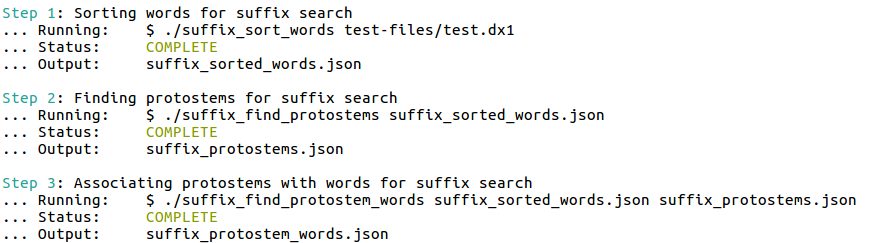

## Testing & Debugging

### General remarks

In this proposal testing and debugging become much easier, because the output of each step of the Crab algorithm can be easily inspected by opening the appropriate file.

Additionally, since Python and C++ code should both emit JSON files formatted in the same way, we can use the same expected test outputs to check both implementations, step by step. No complicated test code is necessary --- all that is required is running a command like [diff](http://man7.org/linux/man-pages/man1/diff.1.html) on two files: a file containing the *expected* output of a step and a file containing the *actual* (tested) output.

### Demo (combining steps)

This proposal includes a script for executing the first three examples in the [Examples](./Examples.md) section, one after another. The script is included to demonstrate how easy it is to combine various steps of the Crab algorithm into a single executor, for testing or experimentation.

To demo the script, first make sure that you have built the examples:

(Pre-install the C++ json library)

```
$ git clone git@github.com:nlohmann/json.git
$ sudo cp -r json/single_include/nlohmann /usr/local/include
```

(Download the example code)

```
$ git clone git@github.com:edahlgren/QtLing.git
$ cd docs/design/RFC-modular-reusable-steps
```

Build the first example (step 1):

```
$ g++ -std=c++11 suffix_sort_words.cpp -o test/suffix_sort_words
```

Build the second example (step 2):

```
$ g++ -std=c++11 suffix_find_protostems.cpp -o test/suffix_find_protostems
```

Build the third example (step 3):

```
$ g++ -std=c++11 suffix_find_protostem_words.cpp -o test/suffix_find_protostem_words
```

Then to execute the script, run (or replace `test.dx1` with any DX1 formatted file):

```
$ cd test
$ ./execute_suffix_steps.sh test.dx1
```

> **NOTE:** If you attempt to run `execute_suffix_steps.sh` without a first argument, it will block indefinitely. You *must* pass the name of a DX1 formatted file.

If all steps succeed, you should see output like this:



[Back to Table of Contents](../README.md)
